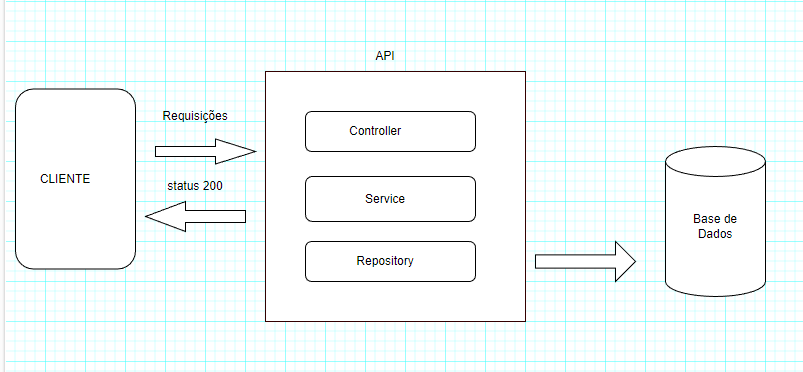
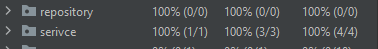

**Fluxo Caixa**

Aplicação de lançamento de Crédito e Débitos utlizando das tecnologias
de MicroServiços Spring Boot, Clean Code, Principio do Solid.

**Desenho da arquitetura**:

**Padrões de microserviço utilizados**

Builder 

Singleton 

Adapter

DTO

**Tecnologias e bibliotecas usadas**

Docker

Spring Boot

Open Api Swagger

Postgres 

**Execução do projeto

**Obg: É necessário ter o docker instalado****

**Obg: É necessário ter o java 19 instalado****

**Obg: É necessário ter o maven instalado****

-> clonar projeto através do link do repositorio publico:

   https://github.com/joaolago38/carrefour-act.git

-> Baixando as depedências do projeto:

Execute o comando mvn clean install para baixar as dependências do projeto através do maven.
Você também pode utilizar o _mvnw_ que vem no arquivo ZIP do mesmo jeitomvnw clean install

->Execute aplicação

Execute o comando mvn spring-boot:run para executar a sua aplicação.
Você também pode utilizar o mvnw que vem no arquivo ZIP do mesmo jeito 
mvnw spring-boot:run.

**Acessar swagger**

http://localhost:8081/swagger-ui/index.html

**Acessar prometheus**

http://localhost:9090/

 

   

**Testes**

Foram utilizados testes unitarios e de integração. A imagem abaixo
mostra a cobertura de codigo dos serviços

